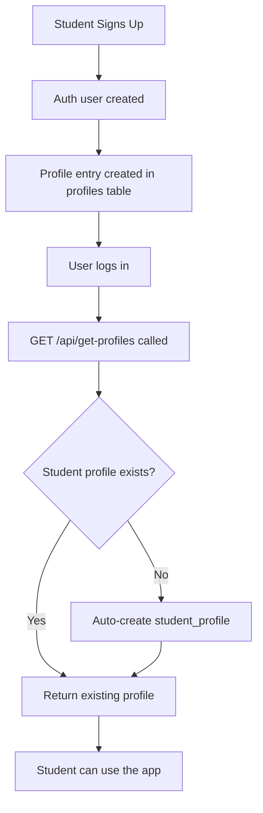

# 🎯 Student Profile System - How It Works

## 📋 Overview

When a new student signs up, the system now **automatically creates** their student profile. This ensures a seamless experience and proper data structure.

---

## 🔄 Student Signup Flow



---

## 🗂️ Database Structure

### **profiles** table
- One entry per user (student, parent, or teacher)
- Contains: `role`, `full_name`, `email`, etc.
- **Cannot be deleted by user**

### **student_profiles** table  
- One entry per student
- Contains: `name`, `grade_level`, `learning_preferences`, etc.
- Links to `profiles` via `owner_id`
- **Auto-created on first login if missing**

### **profile_relationships** table
- Links parents/teachers to students
- Allows parents/teachers to view student data

---

## 🔐 Permissions (RLS Policies)

### **What Students CAN do:**
✅ **View** their own profile  
✅ **Edit** their profile (name, grade level, learning preferences)  
✅ **Create** their profile (auto-created if missing)

### **What Students CANNOT do:**
❌ **Delete** their profile  
❌ **View** other students' profiles  
❌ **Edit** other students' profiles

### **Why students can't delete their profile:**
- **Parent/Teacher Access**: If a student deletes their profile, parents/teachers lose access to their learning history
- **Data Integrity**: All XP, streaks, and problem history is linked to the student profile
- **Account Recovery**: Preserves data even if student wants to "start over"

---

## 👨‍👩‍👧 Parent/Teacher Access

### **How parents/teachers see student data:**

1. Parent/teacher signs up
2. They request to link to a student
3. Admin creates entry in `profile_relationships`
4. Parent/teacher can now:
   - **View** student profile (read-only)
   - **View** student's learning progress
   - **Cannot edit** or delete student profile

---

## 🛠️ Migrations to Run

### **1. Fix XP/Streaks RLS (Already Done)**
```bash
# File: fix_rls_simple.sql
# Allows new users to create XP and streak data
```

### **2. Fix Student Profiles RLS (New)**
```bash
# File: fix_student_profiles_rls.sql
# Run this in Supabase SQL Editor
```

This migration:
- ✅ Allows students to view/edit their own profile
- ✅ Allows parents/teachers to view linked profiles
- ❌ Prevents students from deleting their profile
- ✅ Only service_role (admin) can delete profiles

---

## 📝 Student Profile Fields

### **Editable by Student:**
- `name` - Display name
- `grade_level` - Current grade
- `learning_preferences` - Preferred learning style
- `goals` - Personal learning goals

### **Not Editable by Student:**
- `owner_id` - Links to profiles table (system managed)
- `created_at` - Timestamp (system managed)
- `updated_at` - Timestamp (system managed)

---

## 🎓 Example Use Cases

### **Use Case 1: Student Self-Management**
1. Student logs in
2. Goes to Settings → Profile
3. Updates their name from "Student" to "Sarah"
4. Updates grade level to "8th Grade"
5. Saves changes ✅

### **Use Case 2: Parent Monitoring**
1. Parent logs in
2. Switches to Sarah's profile
3. Views Sarah's XP, streaks, and progress
4. **Cannot** edit Sarah's profile settings
5. **Cannot** delete Sarah's profile

### **Use Case 3: Fresh Start**
1. Student wants to "reset" their account
2. Student **cannot** delete their profile
3. Options:
   - Admin can reset XP/streaks (preserving profile)
   - Admin can create a new student_profile for the same user
   - Student can create a new account (not recommended)

---

## ✅ Testing Checklist

After running migrations, test:

- [ ] New student signup creates profile automatically
- [ ] Student can view their profile
- [ ] Student can edit their name
- [ ] Student **cannot** delete their profile
- [ ] XP and streaks create without errors
- [ ] Problem of the Day saves correctly
- [ ] No HTTP 403 errors in console

---

## 🚀 Summary

**The system now:**
1. ✅ Auto-creates student profiles on first login
2. ✅ Allows students to edit (but not delete) their profile
3. ✅ Preserves data for parent/teacher access
4. ✅ Works seamlessly for new users
5. ✅ Fixes all RLS policy issues

**Next step:** Run `fix_student_profiles_rls.sql` in Supabase SQL Editor!

